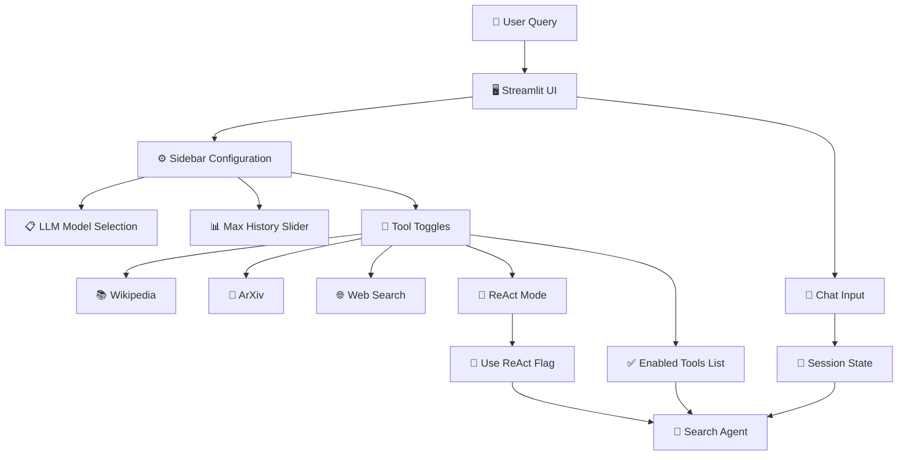

# 🔍 OmniFinder AI - Intelligent Search Agent

[](https://www.python.org/downloads/)
[](LICENSE)
[](https://streamlit.io/)

OmniFinder AI is an intelligent search agent powered by LangChain and LLMs that intelligently routes your queries to the most appropriate search tools. Instead of manually choosing between Wikipedia, academic papers, or web search, let the AI decide what works best for your question.

## ✨ Key Features

- **Intelligent Query Routing**: Automatically classifies queries and routes them to the most relevant search tools
- **Multi-Source Search**: Searches Wikipedia, ArXiv, and Web Search (DuckDuckGo) simultaneously
- **ReAct Agent Pattern**: Implements reasoning and acting loops for complex, multi-step queries
- **Concurrent Execution**: Executes multiple searches in parallel for faster results
- **Conversation Memory**: Maintains context across conversation history for coherent discussions
- **Free LLM Models**: Uses free models via OpenRouter API (no OpenAI costs)
- **Interactive UI**: Streamlit-based web interface with configurable settings
- **Customizable Tools**: Enable/disable search tools on-the-fly
- **Model Flexibility**: Switch between different free LLM models from OpenRouter

## 🎯 Use Cases

- **Research & Learning**: Find comprehensive answers combining academic papers and general knowledge
- **Current Events**: Get the latest information with web search integration
- **Academic Work**: Automatically prioritize ArXiv for research-related queries
- **Technical Documentation**: Combine tutorials, guides, and examples from multiple sources
- **General Knowledge**: Quick answers to "what is" and "explain" style questions

## 📋 Requirements

- **Python**: 3.8 or higher
- **OpenRouter API Key**: Free (for accessing free LLM models)
- **Internet Connection**: Required for search functionality
- **Dependencies**: See [requirements.txt](requirements.txt)

## ⚙️ Installation

### Step 1: Clone the Repository

```bash
git clone https://github.com/ammarmalik17/omnifinder-ai.git
cd omnifinder-ai
```

### Step 2: Create a Virtual Environment

**Windows:**
```bash
python -m venv venv
venv\Scripts\activate
```

**macOS/Linux:**
```bash
python3 -m venv venv
source venv/bin/activate
```

### Step 3: Install Dependencies

```bash
pip install -r requirements.txt
```

### Step 4: Set Up Environment Variables

Create a `.env` file in the project root directory:

```env
OPENROUTER_API_KEY=your_openrouter_api_key_here
```

To get a free OpenRouter API key:
1. Visit [OpenRouter.ai](https://openrouter.ai)
2. Sign up for a free account
3. Navigate to the API Keys section
4. Generate a new API key
5. Copy it to your `.env` file

### Step 5: Run the Application

```bash
streamlit run app.py
```

The application will open in your default web browser at `http://localhost:8501`

## 🚀 Usage

### Basic Search

1. **Enter a Query**: Type your question in the chat input at the bottom of the page
2. **Configure Settings** (optional):
   - Select your preferred LLM model from the sidebar
   - Adjust conversation history depth with the "Max History" slider
   - Enable/disable specific search tools
   - Toggle ReAct mode for complex queries
3. **View Results**: The agent displays search results from the selected tools with synthesized answers

### Example Queries

```
"What are the latest developments in quantum computing?"
→ Automatically uses Web Search for current information

"Explain quantum entanglement"
→ Prioritizes Wikipedia for clear, general knowledge explanation

"Find recent papers on machine learning interpretability"
→ Prioritizes ArXiv for academic research

"How to set up a Python virtual environment? Show me step by step"
→ Combines tutorials from web search with comprehensive Wikipedia context
```

### Configuration Options

#### LLM Model Selection
- Browse available free models from OpenRouter
- Switch models based on:
  - **Speed**: Smaller models are faster
  - **Quality**: Larger models provide better reasoning
  - **Latency**: Local models may have lower latency

#### Max History Slider
- **Values**: 1-50 messages
- **Impact**: Higher values increase context but consume more tokens
- **Use Case**: Increase for complex, multi-turn conversations

#### Tool Toggles
- **Wikipedia**: For general knowledge and definitions
- **ArXiv**: For academic papers and research
- **Web Search**: For current events and comprehensive results
- **ReAct Mode**: Enable for queries requiring complex reasoning

## 🏗️ Architecture

OmniFinder AI is built with a modular, scalable architecture:



### Core Components

- **SearchAgent**: Main orchestrator that coordinates all components
- **QueryClassifier**: Uses LLM to classify queries and determine optimal tools
- **ResultSynthesizer**: Synthesizes results from multiple sources into coherent answers
- **ReAct Agent**: Implements reasoning-acting loops for complex queries
- **ConversationMemory**: Maintains conversation history with token limits
- **Search Tools**: Integrations with Wikipedia, ArXiv, and DuckDuckGo

## 🔧 Configuration Details

### Agent Configuration

Edit `src/config/agent_config.py` to customize:

```python
AgentConfig(
    # LLM Settings
    model_name="openai/gpt-4-turbo",  # Default OpenRouter model
    temperature=0.1,                   # Lower = more deterministic
    
    # Execution Settings
    max_workers=4,                     # Concurrent tool execution threads
    use_react_for_complex=True,        # Enable ReAct for complex queries
    
    # Tool Configuration
    enabled_tools=[...],               # Which search tools are available
    
    # Memory Settings
    max_token_limit=3000,              # Max tokens in conversation
    max_history_messages=10,           # Max messages to retain
    
    # Search Result Limits
    wikipedia_results=5,
    arxiv_max_results=5,
    duckduckgo_max_results=5,
    web_search_max_results=7,
    
    # ReAct Settings
    max_react_iterations=10,           # Max reasoning loops
)
```

## 📦 Dependencies

Key dependencies used in this project:

- **LangChain** (0.1.16+): LLM orchestration framework
- **Streamlit** (1.31.1+): Web interface framework
- **OpenRouter Client**: LLM API integration
- **Wikipedia**: General knowledge search
- **ArXiv**: Academic paper search
- **DuckDuckGo Search (DDGS)**: Web search
- **Pydantic** (2.6.4+): Data validation
- **python-dotenv**: Environment variable management

See [requirements.txt](requirements.txt) for the complete list.

## 🤝 Contributing

Contributions are welcome! Here's how to get started:

### Development Setup

1. Fork the repository
2. Clone your fork: `git clone https://github.com/yourusername/omnifinder-ai.git`
3. Create a feature branch: `git checkout -b feature/your-feature-name`
4. Install development dependencies: `pip install -r requirements.txt`

### Making Changes

1. Follow PEP 8 style guidelines
2. Add docstrings to functions and classes
3. Test your changes locally with `streamlit run app.py`
4. Ensure the application runs without errors

### Submitting Changes

1. Commit your changes: `git commit -m "Add descriptive commit message"`
2. Push to your fork: `git push origin feature/your-feature-name`
3. Open a pull request with:
   - Clear description of changes
   - Any relevant issue numbers
   - Screenshots if UI changes are made

### Areas for Contribution

- **New Search Tools**: Add additional search backends (Google Scholar, PubMed, etc.)
- **UI Improvements**: Enhance the Streamlit interface
- **Agent Enhancements**: Improve query classification or result synthesis
- **Documentation**: Improve README, add tutorials, or create API documentation
- **Testing**: Add unit and integration tests
- **Performance**: Optimize search execution and response times
- **Bug Fixes**: Fix identified issues and edge cases

## ❓ Support & Troubleshooting

### Common Issues

**"Please set your OPENROUTER_API_KEY in the .env file"**
- Ensure your `.env` file exists in the project root
- Verify the API key format is correct
- Check that environment variables are properly loaded

**"Error fetching models"**
- Verify your OpenRouter API key is valid
- Check internet connection
- Try restarting the application

**No search results returned**
- Verify internet connectivity
- Check if the search APIs are accessible
- Try a different query or enable additional tools

**Application runs slowly**
- Reduce `max_workers` in agent configuration
- Lower the model complexity if possible
- Check system resources and available memory

### Getting Help

- Check existing [issues](https://github.com/ammarmalik17/omnifinder-ai/issues)
- Open a new issue with:
  - Detailed error messages
  - Steps to reproduce
  - Your environment information (OS, Python version, etc.)

## 📚 Advanced Usage

### Customizing Search Tools

To add a new search tool:

1. Create a new tool class in `src/tools/search_tools.py` inheriting from `BaseTool`
2. Implement the `_run()` method
3. Add to `get_all_tools()` function
4. Register in `AgentConfig.enabled_tools`

### Custom Query Classifiers

Modify the query classification logic in `src/components/query_classifier.py` to:
- Add domain-specific classification rules
- Adjust tool priority weights
- Implement custom classification algorithms

### Extending Result Synthesis

Enhance `src/components/result_synthesizer.py` to:
- Create custom formatting for results
- Add source attribution
- Implement custom ranking algorithms

## 🗺️ Roadmap

### Planned Features

- **Vector Embeddings**: Add semantic search capabilities
- **Citation Management**: Automatic citation generation
- **Advanced Filtering**: Filter results by date, domain, etc.
- **Custom Instructions**: Support user-defined system prompts
- **Conversation Export**: Save conversations as markdown/PDF
- **Multi-Language Support**: Support queries in multiple languages
- **Browser Extension**: Chrome/Firefox extension for inline search
- **Mobile App**: React Native mobile application
- **Database Integration**: Store search history and preferences
- **Advanced Analytics**: Track query patterns and tool effectiveness

## 📄 License

This project is licensed under the MIT License - see the LICENSE file for details.

---
